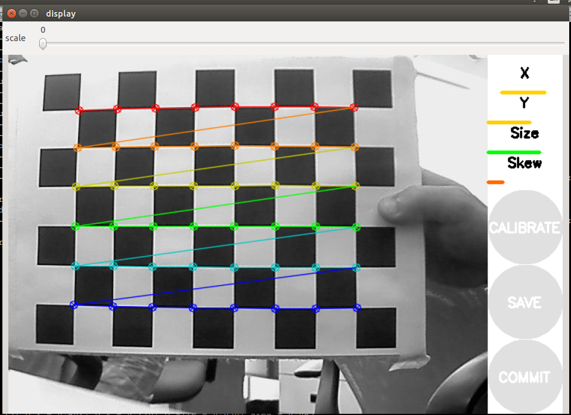

# Initial Camera Setup and Calibration
We use a mix of grayscale Basler ace U acA800-510um and Basler ace 2 a2A1920-51gmBAS. 
While `Braid` comes with it's own internal calibration software, it's very slow and uninformative.
Instead, we are going to use `ROS` camera calibration software.

This guide assumes a completely clean Ubuntu installation; however, if you use the pre-existing installation, you can skip the `Installation` step.

## Installation
1. Install ROS: follow the guide here: <http://wiki.ros.org/noetic/Installation/Ubuntu>

2. Install Pylon Camera sofware (make sure to install **version 6.2**): <https://www2.baslerweb.com/de/downloads/downloads-software/software-pylon-6-2-0-linux-x86-64bit-debian/>

<div class="warning">
While the <code>pylon-ros-camera</code> package requires Pylon 6.2, <code>Braid</code> itself requires Pylon 7.3. Make sure to reinstall it after finishing the calibration.
</div>

3. Install the pylon-ros-camera package: <https://github.com/basler/pylon-ros-camera/tree/master>

Before starting the calibration, open the Pylon viewer to list all the cameras we have available.

Additionally, launch two terminal windows, and for both activate the `catkin` workspace you created in step 3 (`source ~/catkin_ws/devel.setup.bash`)

## Per-camera calibration procedure
- For calibration, I have a checkerboard calibration board printed out, and I put it on a transparent/white plexiglass.
- Before starting calibration, it is recommended to completely remove the arena enclosure so you have more space to move the board.

### Camera Node Terminal
1. In the `pylon-ros-camera` repository, navigate to the `pylon-camera/config/` folder, and open the `default.yaml` file using a text editor (`gedit`).

2. Change the `device_user_id` setting to the first camera you want to calibrate (keep the quotation mark, it doesn't directly accept numbers), and save.

3. Then, launch the camera node by running `roslaunch pylon_camera pylon_camera_node.launch`.

### Camera Calibrator terminal
1. Launch the ros `camera_calibration` app by running:  
`rosrun camera_calibration cameracalibrator.py --size 8x6 --square 0.108 image:=/pylon_camera_node/raw_image camera:=/pylon_camera_node`
Make sure to change the `size` and `square` paramters according to your calibration board (where `square` is in meters).  
It should open a screen that looks like this:  


2. Move the calibration board around the camera, until all bars (X, Y, Size, and Skew) are green.

3. Press the `CALIBRATE` button, and wait for the calibration to finish. You will know it's finished when the text display on the app changes to `lin. [number]`, and the `SAVE` and `COMMIT` buttons are not greyed out.

4. Press the `SAVE` button to save the camera calibration to file. It should save a `tar.gz` file to `/tmp/calibrationdata.tar.gz`.

5. Rename this file to an informative name, such as `Basler-[camera_number]`, and move it to `/home/buchsbaum/.config/strand-cam/camera_calibrations/`

At this point, you can shut down both the camera calibrator app and the pylon_camera_node launched in the other terminal.
Repeat this process for all cameras in the setup.


## Format calibrations
After finishing the calibration procedure for all cameras, navigate to the `/home/buchsbaum/.config/strand-cam/camera_calibrations/` folder.

Open each `tar.gz` file, and extract the `ost.yaml` file. It should have a strcuture similar to this:
```
image_width: 800
image_height: 600
camera_name: narrow_stereo
camera_matrix:
  rows: 3
  cols: 3
  data: [851.62168,   0.     , 404.54958,
           0.     , 850.16932, 269.78434,
           0.     ,   0.     ,   1.     ]
distortion_model: plumb_bob
distortion_coefficients:
  rows: 1
  cols: 5
  data: [-0.253286, 0.132442, -0.000389, 0.000453, 0.000000]
rectification_matrix:
  rows: 3
  cols: 3
  data: [1., 0., 0.,
         0., 1., 0.,
         0., 0., 1.]
projection_matrix:
  rows: 3
  cols: 4
  data: [803.94476,   0.     , 404.85451,   0.     ,
           0.     , 821.30469, 267.30052,   0.     ,
           0.     ,   0.     ,   1.     ,   0.     ]
```
Change the `camera_name` parameter to `Basler_[camera-number]` (the same as the `.tar.gz` filename), and similarly rename the `ost.yaml` file to `basler_[camera-number]`.

Now, move this file to the `/home/buchsbaum/.config/strand-cam/camera_info/` folder. If an older file with the same name already exists, make sure to rename it to something like `basler-[camera-number].yaml.bak`, just as a precaution.


That's it! Now we move on to using this data to calibrate the `Braid` tracking system